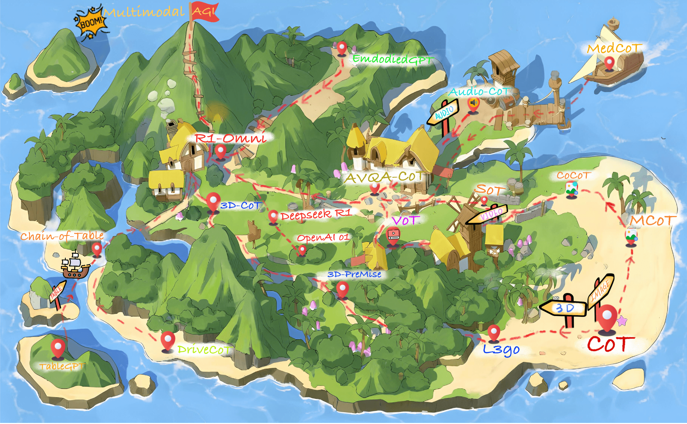
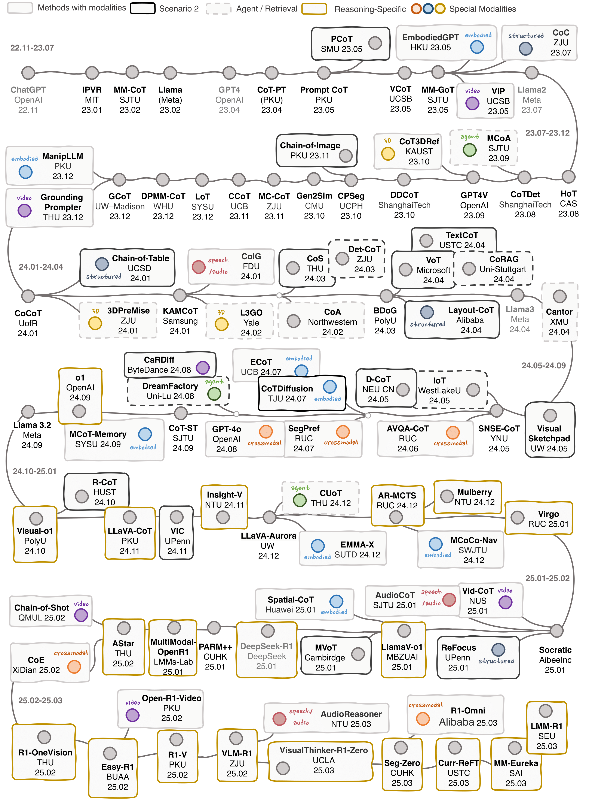
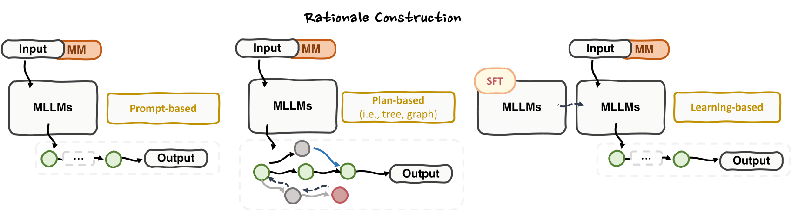
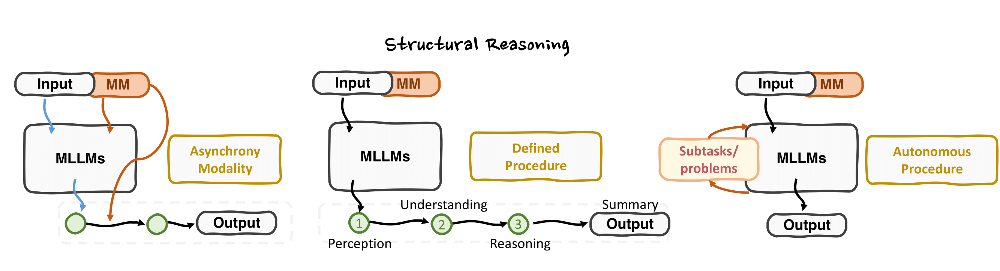
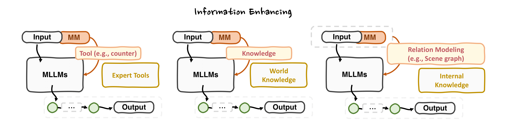
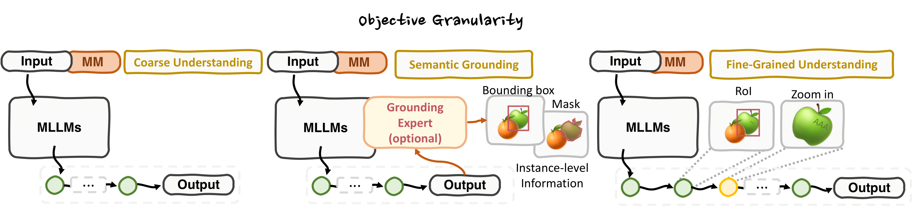
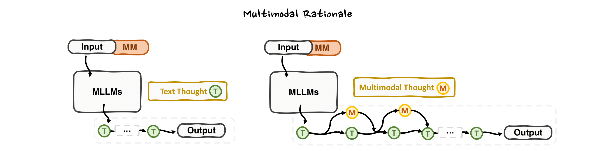
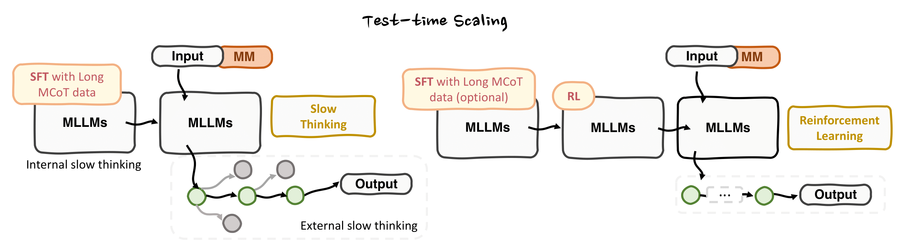

<h2 align="center">Multimodal Chain-of-Thought Reasoning: A Comprehensive Survey</h2>
<!-- <h1 align="center">Awesome-MCoT</h1> -->
<div align="center">

[](https://arxiv.org/abs/2503.12605)
[](https://github.com/yaotingwangofficial/Awesome-MCoT/issues/1)
[](https://github.com/yaotingwangofficial/Awesome-MCoT/discussions)
[](https://github.com/yaotingwangofficial/Awesome-MCoT/issues/4)
[](https://join.slack.com/t/mcot/shared_invite/zt-329e3dpuf-Fr~umfXWlhxONrdgERKSaQ)


</div>


> 💡 *You're very welcome to join our discussion (on WeChat or Slack) on the topic of multimodal reasoning.*  
> 📌 *Please feel free to ping us for any possibly missed related work.*


<p align="center">
  
</p>


# 🎇 Introduction

Multimodal chain-of-thought (MCoT) reasoning has garnered attention for its ability to enhance ***step-by-step*** reasoning in multimodal contexts, particularly within multimodal large language models (MLLMs). Current MCoT research explores various methodologies to address the challenges posed by images, videos, speech, audio, 3D data, and structured data, achieving success in fields such as robotics, healthcare, and autonomous driving. However, despite these advancements, the field lacks a comprehensive review that addresses the numerous remaining challenges.

To fill this gap, we present [**_the first systematic survey of MCoT reasoning_**](https://arxiv.org/abs/2503.12605), elucidating the foundational concepts and definitions pertinent to this area. Our work includes a detailed taxonomy and an analysis of existing methodologies across different applications, as well as insights into current challenges and future research directions aimed at fostering the development of soning.

<p align="center">
  
</p>


---


### Updates
> 2025-05-20: We upload the Chiense language version, enjoy! <br>
> 2025-04-25: We gain 500 stars! Thank you all! <br>
> 2025-03-18: We release the Awesome-MCoT repo and survey. 

---
# 📕 Table of Contents

- [🎖 MCoT Datasets and Benchmarks](#-mcot-datasets-and-benchmarks)
  - [Training with rationale](#tab-1-datasets-for-mcot-training-with-rationale)
  - [Evaluation without rationale](#tab-2-benchmarks-for-mcot-evaluation-without-rationale)
  - [Evaluation with rationale](#tab-3-benchmarks-for-mcot-evaluation-with-rationale)
- [🎊 Multimodal Reasoning via RL](#-multimodal-reasoning-via-rl)
- [✨ MCoT Over Various Modalities](#-mcot-over-various-modalities)
  - [MCoT Reasoning Over Image](#mcot-reasoning-over-image)
  - [MCoT Reasoning Over Video](#mcot-reasoning-over-video) 
  - [MCoT Reasoning Over 3D](#mcot-reasoning-over-3d) 
  - [MCoT Reasoning Over Audio and Speech](#mcot-reasoning-over-audio-and-speech) 
  - [MCoT Reasoning Over Table and Chart](#mcot-reasoning-over-table-and-chart) 
  - [Cross-modal CoT Reasoning](#cross-modal-cot-reasoning) 
- [🔥 MCoT Methodologies](#-mcot-methodologies)
  - [Rationale Construction](#retionale-construction)
  - [Structural Reasoning](#structural-reasoning)
  - [Information Enhancing](#information-enhancing)
  - [Objective Granularity](#objective-granularity)
  - [Multimodal Rationale](#multimodal-relationale)
  - [Test-Time Scaling](#test-time-scaling)
- [🎨 Applications with MCoT Reasoning](#-applications-with-mcot-reasoning)
  - [Embodied AI](#embodied-ai)
  - [Agentic System](#agentic-system)
  - [Autonomous Driving](#autonomous-driving)
  - [Medical and Healthcare](#medical-and-healthcare)
  - [Social and Human](#social-and-human)
  - [Multimodal Generation](#multimodal-generation)
- [🚀 Useful Links](#-useful-links)
- [❤️ Citation](#%EF%B8%8F-citation)
- [⭐️ Star History](#%EF%B8%8F-star-history)

---

# 🎖 MCoT Datasets and Benchmarks
* "MC" and "Open" refer to multiple-choice and open-ended answer formats.
* "T", "I", "V", and "A" represent Text, Image, Video, and Audio, respectively.

### Tab-1: Datasets for MCoT _Training_ _with_ Rationale. 
| Datasets                  | Year | Task              | Domain               | Modality | Format         | Samples   |
|:---------------------------:|:------:|:-------------------:|:----------------------:|:----------:|:----------------:|:-----------:|
| [ScienceQA](https://scienceqa.github.io/)                 | 2022 | VQA               | Science              | T, I     | MC             | 21K       |
| [A-OKVQA](https://github.com/allenai/aokvqa)                   | 2022 | VQA               | Common               | T, I     | MC             | 25K       |
| [EgoCoT](https://github.com/EmbodiedGPT/EgoCOT_Dataset)                    | 2023 | VideoQA           | Common               | T, V     | Open           | 200M      |
| [VideoCoT](https://arxiv.org/pdf/2407.05355)                  | 2024 | VideoQA           | Human Action         | T, V     | Open           | 22K       |
| [VideoEspresso](https://github.com/hshjerry/VideoEspresso)             | 2024 | VideoQA           | Common               | T, V     | Open           | 202,164   |
| [EMMA-X](https://github.com/declare-lab/Emma-X)                    | 2024 | Robot Manipulation| Indoor               | T, V     | Robot Actions  | 60K       |
| [M3CoT](https://github.com/LightChen233/M3CoT)                     | 2024 | VQA               | Science, Math, Common| T, I     | MC             | 11.4K     |
| [MAVIS](https://github.com/ZrrSkywalker/MAVIS)                     | 2024 | ScienceQA         | Math                 | T, I     | MC and Open    | 834K      |
| [LLaVA-CoT-100k](https://github.com/PKU-YuanGroup/LLaVA-CoT)            | 2024 | VQA               | Common, Science      | T, I     | MC and Open    | 834K      |
| [MAmmoTH-VL](https://mammoth-vl.github.io/)                | 2024 | Diverse           | Diverse              | T, I     | MC and Open    | 12M       |
| [Mulberry-260k](https://github.com/HJYao00/Mulberry)             | 2024 | Diverse           | Diverse              | T, I     | MC and Open    | 260K      |
| [MM-Verify](https://github.com/Aurora-slz/MM-Verify)                 | 2025 | MathQA            | Math                 | T, I     | MC and Open    | 59,772    |
| [VisualPRM400K](https://internvl.github.io/blog/2025-03-13-VisualPRM/)             | 2025 | ScienceQA         | Math, Science        | T, I     | MC and Open    | 400K      |
| [R1-OneVision](https://github.com/Fancy-MLLM/R1-Onevision)              | 2025 | Diverse           | Diverse              | T, I     | MC and Open    | 155K      |


### Tab-2: Benchmarks for MCoT _Evaluation_ _without_ Rationale.
| Datasets                  | Year | Task              | Domain               | Modality | Format         | Samples   |
|:---------------------------:|:------:|:-------------------:|:----------------------:|:----------:|:----------------:|:-----------:|
| [MMMU](https://mmmu-benchmark.github.io/)                      | 2023 | VQA               | Arts, Science        | T, I     | MC and Open    | 11.5K     |
| [SEED](https://github.com/ailab-cvc/seed-bench)                      | 2023 | VQA               | Common               | T, I     | MC             | 19K       |
| [MathVista](https://mathvista.github.io/)                 | 2023 | ScienceQA         | Math                 | T, I     | MC and Open    | 6,141     |
| [MathVerse](https://mathverse-cuhk.github.io/)                 | 2024 | ScienceQA         | Math                 | T, I     | MC and Open    | 15K       |
| [Math-Vision](https://github.com/mathllm/MATH-V)               | 2024 | ScienceQA         | Math                 | T, I     | MC and Open    | 3040      |
| [MeViS](https://henghuiding.github.io/MeViS/)                     | 2023 | Referring VOS     | Common               | T, V     | Dense Mask     | 2K        |
| [VSIBench](https://github.com/vision-x-nyu/thinking-in-space)                  | 2024 | VideoQA           | Indoor               | T, V     | MC and Open    | 5K        |
| [HallusionBench](https://github.com/tianyi-lab/HallusionBench)            | 2024 | VQA               | Common               | T, I     | Yes-No         | 1,129     |
| [AV-Odyssey](https://av-odyssey.github.io/)                | 2024 | AVQA              | Common               | T, V, A  | MC             | 4,555     |
| [AVHBench](https://github.com/kaist-ami/AVHBench)                  | 2024 | AVQA              | Common               | T, V, A  | Open           | 5,816     |
| [RefAVS-Bench](https://github.com/GeWu-Lab/Sounding-Object-Segmentation-Preference)              | 2024 | Referring AVS     | Common               | T, V, A  | Dense Mask     | 4,770     |
| [MMAU](https://mmaubench.github.io/)                      | 2024 | AQA               | Common               | T, A     | MC             | 10K       |
| [AVTrustBench](https://arxiv.org/pdf/2501.02135)              | 2025 | AVQA              | Common               | T, V, A  | MC and Open    | 600K      |
| [MIG-Bench](https://github.com/thunlp/Migician)                 | 2025 | Multi-image Grounding | Common          | T, I     | BBox           | 5.89K     |
| [MedAgentsBench](https://github.com/gersteinlab/medagents-benchmark)            | 2025 | MedicalQA         | Medical              | T, I     | MC and Open    | 862       |
| [OSWorld](https://github.com/xlang-ai/OSWorld)            | 2024 | Agent         | Real Comp. Env.              | T, I     | Agent Action    |  369       |
| [AgentClinic](https://github.com/SamuelSchmidgall/AgentClinic)            | 2024 | MedicalQA         | Medical              | T, I     | Open    |  335    |


### Tab-3: Benchmarks for MCoT _Evaluation_ _with_ Rationale.
| Datasets                  | Year | Task              | Domain               | Modality | Format         | Samples   |
|:---------------------------:|:------:|:-------------------:|:----------------------:|:----------:|:----------------:|:-----------:|
| [CoMT](https://github.com/czhhzc/CoMT)                      | 2024 | VQA               | Common               | T, I     | MC             | 3,853     |
| [OmniBench](https://m-a-p.ai/OmniBench/)                 | 2024 | VideoQA           | Common               | T, I, A  | MC             | 1,142     |
| [WorldQA](https://zhangyuanhan-ai.github.io/WorldQA/)                   | 2024 | VideoQA           | Common               | T, V, A  | Open           | 1,007     |
| [MiCEval](https://github.com/alenai97/miceval)                   | 2024 | VQA               | Common               | T, I     | Open           | 643       |
| [OlympiadBench](https://github.com/OpenBMB/OlympiadBench)             | 2024 | ScienceQA         | Maths, Physics       | T, I     | Open           | 8,476     |
| [MME-CoT](https://mmecot.github.io/)                  | 2025 | VQA               | Science, Math, Common| T, I     | MC and Open    | 1,130     |
| [EMMA](https://github.com/hychaochao/EMMA)                      | 2025 | VQA               | Science              | T, I     | MC and Open    | 2,788     |
| [VisualProcessBench](https://huggingface.co/datasets/OpenGVLab/VisualProcessBench)        | 2025 | ScienceQA         | Math, Science        | T, I     | MC and Open    | 2,866     |


---


# 🎊 Multimodal Reasoning via RL
* The following table concludes the techniques used by MLLMs with RL for better long-MCoT reasoning, where "T", "I", "V", and "A" represent Text, Image, Video, and Audio, respectively.
* In summary, RL unlocks complex reasoning and `aha-moment` without SFT, demonstrating its potential to enhance model capabilities through iterative self-improvement and rule-based approaches, ultimately paving the way for more advanced and autonomous multimodal reasoning systems.

| Model                  | Foundational LLMs | Modality              | Learning               | Cold Start | Algorithm         | Aha-moment   |
|:---------------------------:|:------:|:-------------------:|:----------------------:|:----------:|:----------------:|:-----------:|
| [Deepseek-R1-Zero](https://github.com/deepseek-ai/DeepSeek-R1)                      | Deepseek-V3 | T               | RL               | ❌   | GRPO             | ✅    |
| [Deepseek-R1](https://github.com/deepseek-ai/DeepSeek-R1)                     | Deepseek-V3 | T               | SFT+RL               | ✅    | GRPO             | -   |
| [LLaVA-Reasoner](https://github.com/RifleZhang/LLaVA-Reasoner-DPO)                        | LLaMA3-LLaVA-NEXT-8B | T,I               | SFT+RL               | ✅    | DPO             | -   |
| [Insight-V](https://github.com/dongyh20/Insight-V)                      | Deepseek-V3 | T,I                | SFT+RL               | ✅    | DPO             | -   |
| [Multimodal-Open-R1](https://github.com/EvolvingLMMs-Lab/open-r1-multimodal)                       | Qwen2-VL-7B-Instruct | T,I                | RL               | ❌   | GRPO             | ❌   |
| [R1-OneVision](https://github.com/Fancy-MLLM/R1-Onevision)                      | Qwen2.5-VL-7B-Instruct | T,I                | SFT               | -   | -             | -   |
| [R1-V](https://github.com/Deep-Agent/R1-V)                       | Qwen2.5-VL | T,I                | RL               | ❌   | GRPO             | ❌   |
| [VLM-R1](https://github.com/om-ai-lab/VLM-R1)                      | Qwen2.5-VL | T,I                | RL               | ❌   | GRPO             | ❌   |
| [LMM-R1](https://github.com/TideDra/lmm-r1)                     | Qwen2.5-VL-Instruct-3B | T,I                | RL               | ❌   | PPO             | ❌   |
| [Curr-ReFT](https://github.com/ding523/Curr_REFT)                      | Qwen2.5-VL-3B | T,I                | RL+SFT               | ❌   | GRPO             | -   |
| [Seg-Zero](https://github.com/dvlab-research/Seg-Zero)                      | Qwen2.5-VL-3B + SAM2 | T,I                | RL               | ❌   | GRPO             | ❌   |
| [MM-Eureka](https://github.com/ModalMinds/MM-EUREKA)                    | InternVL2.5-Instruct-8B | T,I                | SFT+RL               | ✅  | RLOO             | -   |
| [MM-Eureka-Zero](https://github.com/ModalMinds/MM-EUREKA)                      | InternVL2.5-Pretrained-38B | T,I                | RL               | ❌   | GRPO             | ✅    |
| [VisualThinker-R1-Zero](https://github.com/turningpoint-ai/VisualThinker-R1-Zero)                       | Qwen2-VL-2B | T,I                | RL               | ❌   | GRPO             | ✅    |
| [Easy-R1](https://github.com/hiyouga/EasyR1)                        | Qwen2.5-VL | T,I                | RL               | ❌   | GRPO             | -   |
|  [Open-R1-Video](https://github.com/Wang-Xiaodong1899/Open-R1-Video)                       | Qwen2-VL-7B | T,I,V             | RL               | ❌   | GRPO             | ❌   |
| [R1-Omni](https://github.com/HumanMLLM/R1-Omni)                      | HumanOmni-0.5B  | T,I,V,A             | SFT+RL               | ✅  | GRPO             | -  |
| [VisRL](https://github.com/zhangquanchen/VisRL)                      | Qwen2.5-VL-7B  | T,I            | SFT+RL               | ✅  | DPO             | -  |
| [R1-VL]()                      | Qwen2-VL-7B  | T,I            | RL               | ❌  | StepGPRO             | -  |
| [OpenVLThinker](https://github.com/yihedeng9/OpenVLThinker) | Qwen2.5-VL-7B-Instruct | T,I | SFT+RL | ✅ | GRPO | - |
| [EchoInk-R1](https://arxiv.org/abs/2505.04623) | Qwen2.5-Omni-7B | T, I, A | RL | ❌ | GRPO | ✅ |

---
<!-- CVPR-8A2BE2 -->
<!-- WACV-6a5acd -->
<!-- NIPS-CD5C5C -->
<!-- ICML-FF7F50 -->
<!-- ICCV-00CED1 -->
<!-- ECCV-1e90ff -->
<!-- TPAMI-BC8F8F -->
<!-- IJCAI-228b22 -->
<!-- AAAI-c71585 -->
<!-- arXiv-b22222 -->
<!-- ACL-191970 -->
<!-- EMNLP-191970 -->
<!-- TPAMI-ffa07a -->


# ✨ MCoT Over Various Modalities
### MCoT Reasoning Over Image

#### 2025

+ [**Embodied-Reasoner: Synergizing Visual Search, Reasoning, and Action for Embodied Interactive Tasks**](https://arxiv.org/abs/2503.21696) []() [](https://github.com/zwq2018/embodied_reasoner) [](https://huggingface.co/datasets/zwq2018/embodied_reasoner)<!-- 03-25 -->

+ [**VLM-R1**](https://github.com/om-ai-lab/VLM-R1) [](https://github.com/om-ai-lab/VLM-R1)

+ [**MM-Eureka: Exploring Visual Aha Moment with Rule-based Large-scale Reinforcement Learning**](https://github.com/ModalMinds/MM-EUREKA) [](https://github.com/ModalMinds/MM-EUREKA) <!-- 03-25 -->

+ [**Vision-R1: Incentivizing Reasoning Capability in Multimodal Large Language Models**](https://arxiv.org/abs/2503.06749) []()  [](https://github.com/Osilly/Vision-R1)

+ [**VisRL: Intention-Driven Visual Perception via Reinforced Reasoning**](https://arxiv.org/abs/2503.07523) []() [](https://github.com/zhangquanchen/VisRL)

+ [**VR1-VL: Learning to Reason with Multimodal Large Language Models via Step-wise Group Relative Policy Optimization**](https://arxiv.org/abs/2503.12937) []() [](https://github.com/jingyi0000/R1-VL)

+ [**R1-Onevision: Advancing Generalized Multimodal Reasoning through Cross-Modal Formalization**](https://arxiv.org/abs/2503.10615) []()  [](https://github.com/Fancy-MLLM/R1-onevision)

+ [**LMM-R1: Empowering 3B LMMs with Strong Reasoning Abilities Through Two-Stage Rule-Based RL**](https://arxiv.org/abs/2503.07536) []()  [](https://github.com/TideDra/lmm-r1)  <!-- 03-25 -->

+ [**LVisual-RFT: Visual Reinforcement Fine-Tuning**](https://arxiv.org/abs/2503.01785) []()  [](https://github.com/Liuziyu77/Visual-RFT)  <!-- 03-25 -->

+ [**Boosting the Generalization and Reasoning of Vision Language Models with Curriculum Reinforcement Learning**](https://arxiv.org/abs/2503.07065) []()  <!-- 03-25 -->

+ [**R1-Zero's "Aha Moment" in Visual Reasoning on a 2B Non-SFT Model**](https://arxiv.org/abs/2503.05132) []()  [](https://github.com/turningpoint-ai/VisualThinker-R1-Zero)  <!-- 03-25 -->

+ [**CreatiLayout: Siamese Multimodal Diffusion Transformer for Creative Layout-to-Image Generation**](https://arxiv.org/abs/2412.03859) []()  [](https://github.com/HuiZhang0812/CreatiLayout) <!-- 03-25 -->

+ [**Seg-Zero: Reasoning-Chain Guided Segmentation via Cognitive Reinforcement**](https://arxiv.org/abs/2503.06520) []()  [](https://github.com/dvlab-research/Seg-Zero) <!-- 03-25 -->

+ [**Sketch-of-Thought: Efficient LLM Reasoning with Adaptive Cognitive-Inspired Sketching**](https://arxiv.org/abs/2503.05179) []() [](https://github.com/SimonAytes/SoT)  

+ [**Boosting Multimodal Reasoning with MCTS-Automated Structured Thinking**](https://arxiv.org/abs/2502.02339) []()  <!-- 02-25 -->

+ [**Virgo: A Preliminary Exploration on Reproducing o1-like MLLM**](https://arxiv.org/abs/2501.01904) []()  [](https://github.com/RUCAIBox/Virgo) <!-- 02-25 -->

+ [**LLaVA-CoT: Let Vision Language Models Reason Step-by-Step**](https://arxiv.org/abs/2411.10440) []()  [](https://github.com/PKU-YuanGroup/LLaVA-CoT) <!-- 02-25 -->

+ [**Multimodal Open R1**](https://github.com/EvolvingLMMs-Lab/open-r1-multimodal) [](https://github.com/EvolvingLMMs-Lab/open-r1-multimodal) <!-- 01-25 -->

+ [**Easy-R1**](https://github.com/hiyouga/EasyR1) [](https://github.com/hiyouga/EasyR1)

+ [**R1V**](https://github.com/Deep-Agent/R1-V) [](https://github.com/Deep-Agent/R1-V)

+ [**RedStar: Does Scaling Long-CoT Data Unlock Better Slow-Reasoning Systems?**](https://arxiv.org/abs/2501.11284) []()  [](https://huggingface.co/RedStar-Reasoning) <!-- 01-25 -->

+ [**LlamaV-o1: Rethinking Step-by-step Visual Reasoning in LLMs**](https://arxiv.org/abs/2501.06186) []()  [](https://github.com/mbzuai-oryx/LlamaV-o1) <!-- 01-25 -->

+ [**RelationLMM: Large Multimodal Model as Open and Versatile Visual Relationship Generalist**](https://ieeexplore.ieee.org/document/10845195) []() <!-- 01-25 -->

+ [**Imagine while Reasoning in Space: Multimodal Visualization-of-Thought**](https://arxiv.org/abs/2501.07542) []() <!-- 01-25 -->

+ [**Can We Generate Images with CoT? Let's Verify and Reinforce Image Generation Step by Step**](https://arxiv.org/abs/2501.13926) []()  [](https://github.com/ZiyuGuo99/Image-Generation-CoT) <!-- 01-25 -->


#### 2024

+ [**Mulberry: Empowering MLLM with o1-like Reasoning and Reflection via Collective Monte Carlo Tree Search**](https://arxiv.org/abs/2412.18319) []()  [](https://github.com/HJYao00/Mulberry) <!-- 12-24 -->

+ [**AR-MCTS: Progressive Multimodal Reasoning via Active Retrieval**](https://arxiv.org/abs/2412.14835) []() <!-- 12-24 -->  

+ [**Perception Tokens Enhance Visual Reasoning in Multimodal Language Models**](https://arxiv.org/abs/2412.03548v2) []() [](https://github.com/mahtabbigverdi/Aurora/tree/main) <!-- 12-24 -->

+ [**PKRD-CoT: A Unified Chain-of-thought Prompting for Multi-Modal Large Language Models in Autonomous Driving**](https://arxiv.org/abs/2412.02025) []() <!-- 12-24 -->

+ [**MAmmoTH-VL: Eliciting Multimodal Reasoning with Instruction Tuning at Scale**](https://arxiv.org/abs/2412.05237) []()  [](https://github.com/MAmmoTH-VL/MAmmoTH-VL) <!-- 12-24 -->

+ [**Insight-V: Exploring Long-Chain Visual Reasoning with Multimodal Large Language Models**](https://arxiv.org/abs/2411.14432) []()  [](https://github.com/dongyh20/Insight-V) <!-- 11-24 -->

+ [**Visual Sketchpad: Sketching as a Visual Chain of Thought for Multimodal Language Models**](https://arxiv.org/abs/2406.09403) []()  [](https://github.com/Yushi-Hu/VisualSketchpad)  <!-- 11-24 -->

+ [**Visual CoT: Advancing MLLMs with a Comprehensive Dataset and Benchmark for Chain-of-Thought Reasoning**](https://arxiv.org/abs/2403.16999) []() [](https://github.com/deepcs233/Visual-CoT)  <!-- 11-24 -->

+ [**Enhancing Large Vision Language Models with Self-Training on Image Comprehension**](https://arxiv.org/abs/2405.19716) []() [](https://github.com/yihedeng9/STIC) <!-- 11-24 -->

+ [**PS-CoT-Adapter: adapting plan-and-solve chain-of-thought for ScienceQA**](https://link.springer.com/article/10.1007/s11432-024-4211-9) []() [](https://github.com/Sunhxxin/PS-CoT-Adapter)  <!-- 11-24 -->

+ [**Improve Vision Language Model Chain-of-thought Reasoning**](https://arxiv.org/abs/2410.16198) []()  [](https://github.com/RifleZhang/LLaVA-Reasoner-DPO) <!-- 10-24 -->

+ [**Mind's Eye of LLMs: Visualization-of-Thought Elicits Spatial Reasoning in Large Language Models**](https://arxiv.org/abs/2404.03622) []()  [](https://github.com/sitloboi2012/Visualization-of-Thought) <!-- 10-24 -->

+ [**R-CoT: Reverse Chain-of-Thought Problem Generation for Geometric Reasoning in Large Multimodal Models**](https://arxiv.org/abs/2410.17885) []() [](https://github.com/dle666/r-cot) <!-- 10-24 -->

+ [**DCoT: Dual Chain-of-Thought Prompting for Large Multimodal Models**](https://openreview.net/forum?id=0saecDOdh2) []() <!-- 10-24 -->

+ [**Visual-O1: Understanding Ambiguous Instructions via Multi-modal Multi-turn Chain-of-thoughts Reasoning**](https://arxiv.org/abs/2410.03321) []()  [](https://github.com/kodenii/Visual-O1) <!-- 10-24 -->

+ [**Chain-of-Exemplar: Enhancing Distractor Generation for Multimodal Educational Question Generation**](https://aclanthology.org/2024.acl-long.432/) []() [](https://github.com/Luohh5/Chain-of-Exemplar)  <!-- 08-24 -->

+ [**A Picture Is Worth a Graph: A Blueprint Debate Paradigm for Multimodal Reasoning**](https://arxiv.org/abs/2403.14972) []() [](https://github.com/thecharm/BDoG) <!-- 08-24 -->
 
+ [**DetToolChain: A New Prompting Paradigm to Unleash Detection Ability of MLLM**](https://arxiv.org/abs/2403.12488) []()  [](https://github.com/yixuan730/DetToolChain) <!-- 07-24 -->

+ [**RAGAR, Your Falsehood Radar: RAG-Augmented Reasoning for Political Fact-Checking using Multimodal Large Language Models**](https://arxiv.org/abs/2404.12065) []() <!-- 07-24 -->

+ [**PromptCoT: Align Prompt Distribution via Adapted Chain-of-Thought**](https://ieeexplore.ieee.org/iel8/10654794/10654797/10656469.pdf) []()  <!-- 06-24 -->

+ [**MC-CoT: A Modular Collaborative CoT Framework for Zero-shot Medical-VQA with LLM and MLLM Integration**](https://arxiv.org/abs/2410.04521) []() [](https://github.com/thomaswei-cn/MC-CoT)

+ [**Enhancing Semantics in Multimodal Chain of Thought via Soft Negative Sampling**](https://aclanthology.org/2024.lrec-main.537/) []()  <!-- 05-24 -->

+ [**Multimodal Chain-of-Thought Reasoning in Language Models**](https://arxiv.org/abs/2302.00923) []() [](https://github.com/amazon-science/mm-cot) 


+ [**Cantor: Inspiring Multimodal Chain-of-Thought of MLLM**](https://arxiv.org/abs/2404.16033) []() [](https://github.com/ggg0919/cantor) <!-- 04-24 -->

+ [**TextCoT: Zoom In for Enhanced Multimodal Text-Rich Image Understanding**](https://arxiv.org/abs/2404.09797) []() [](https://github.com/bzluan/TextCoT) <!-- 04-24 -->

+ [**Beyond Chain-of-Thought, Effective Graph-of-Thought Reasoning in Language Models**](https://arxiv.org/abs/2305.16582) []() [](https://github.com/Zoeyyao27/Graph-of-Thought) <!-- 03-24 -->

+ [**Chain-of-Spot: Interactive Reasoning Improves Large Vision-Language Models**](https://arxiv.org/abs/2403.12966) []() [](https://github.com/dongyh20/Chain-of-Spot)  <!-- 03-24 -->

+ [**Compositional Chain-of-Thought Prompting for Large Multimodal Models**](https://arxiv.org/abs/2311.17076) []() [](https://github.com/chancharikmitra/CCoT)

+ [**KAM-CoT: Knowledge Augmented Multimodal Chain-of-Thoughts Reasoning**](https://arxiv.org/abs/2401.12863) []() <!-- 01-24 -->

+ [**CoCoT: Contrastive Chain-of-Thought Prompting for Large Multimodal Models with Multiple Image Inputs**](https://arxiv.org/abs/2401.02582) []() <!-- 01-24 -->


#### 2023
+ [**CoTDet: Affordance Knowledge Prompting for Task Driven Object Detection**](https://openaccess.thecvf.com/content/ICCV2023/papers/Tang_CoTDet_Affordance_Knowledge_Prompting_for_Task_Driven_Object_Detection_ICCV_2023_paper.pdf) []()  [](https://toneyaya.github.io/cotdet)

+ [**Dolphins: Multimodal Language Model for Driving**](https://arxiv.org/abs/2312.00438) []() [](https://github.com/vlm-driver/Dolphins)  <!-- 12-23 -->

+ [**Multi-modal Latent Space Learning for Chain-of-Thought Reasoning in Language Models**](https://ojs.aaai.org/index.php/AAAI/article/view/29776/31338) []() [](https://github.com/shimurenhlq/DPMM-COT) <!-- 11-23 -->

+ [**The Art of SOCRATIC QUESTIONING: Recursive Thinking with Large Language Models**](https://arxiv.org/abs/2305.14999) []() [](https://github.com/VT-NLP/SOCRATIC-QUESTIONING) <!-- 11-23 -->

+ [**Chain of Images for Intuitively Reasoning**](https://arxiv.org/abs/2311.09241) []()  [](https://github.com/GraphPKU/CoI) <!-- 11-23 -->

+ [**CPSeg: Finer-grained Image Semantic Segmentation via Chain-of-Thought Language Prompting**](https://arxiv.org/abs/2310.16069) []()   <!-- 10-23 -->

+ [**DDCoT: Duty-Distinct Chain-of-Thought Prompting for Multimodal Reasoning in Language Models**](https://arxiv.org/abs/2310.16436) []() [](https://github.com/SooLab/DDCOT)  <!-- 10-23 -->

+ [**Thinking Like an Expert:Multimodal Hypergraph-of-Thought (HoT) Reasoning to boost Foundation Modals**](https://arxiv.org/abs/2308.06207) []()  <!-- 08-23 -->

+ [**LayoutLLM-T2I: Eliciting Layout Guidance from LLM for Text-to-Image Generation**](https://arxiv.org/abs/2308.05095) []()  [](https://github.com/LayoutLLM-T2I/LayoutLLM-T2I)  <!-- 08-23 -->

+ [**See, Think, Confirm: Interactive Prompting Between Vision and Language Models for Knowledge-based Visual Reasoning**](https://arxiv.org/abs/2301.05226) []()  <!-- 01-23 -->


-----


### MCoT Reasoning Over Video

#### 2025

+ [**Video-R1: Towards Super Reasoning Ability in Video Understanding**](https://github.com/tulerfeng/Video-R1) [](https://github.com/tulerfeng/Video-R1)

+ [**CoS: Chain-of-Shot Prompting for Long Video Understanding**](https://arxiv.org/abs/2502.06428) []() [](https://github.com/lwpyh/CoS_codes)   <!-- 02-25 -->

+ [**video-SALMONN-o1: Reasoning-enhanced Audio-visual Large Language Model**](https://arxiv.org/abs/2502.06428) []() [](https://github.com/BriansIDP/video-SALMONN-o1)   <!-- 02-25 -->
  
+ [**Following Clues, Approaching the Truth: Explainable Micro-Video Rumor Detection via Chain-of-Thought Reasoning**](https://openreview.net/pdf/6c509d93a31887cb5e3feaae2a453c392028dfdb.pdf) []()    <!-- 01-25 -->


#### 2024

+ [**Analyzing Key Factors Influencing Emotion Prediction Performance of VLLMs in Conversational Contexts**](https://aclanthology.org/2024.emnlp-main.331.pdf) []()    <!-- 11-24 -->

+ [**Interpretable Video based Stress Detection with Self-Refine Chain-of-thought Reasoning**](https://arxiv.org/abs/2410.09449) []()   <!-- 11-24 -->

+ [**TI-PREGO: Chain of Thought and In-Context Learning for Online Mistake Detection in PRocedural EGOcentric Videos**](https://arxiv.org/abs/2411.02570) []()  <!-- 11-24 -->

+ [**CaRDiff: Video Salient Object Ranking Chain of Thought Reasoning for Saliency Prediction with Diffusion**](https://arxiv.org/abs/2408.12009) []()  <!-- 08-24 -->

+ [**DreamFactory: Pioneering Multi-Scene Long Video Generation with a Multi-Agent Framework**](https://arxiv.org/abs/2408.11788) []()   <!-- 08-24 -->

+ [**Large Vision-Language Models as Emotion Recognizers in Context Awareness**](https://arxiv.org/abs/2407.11300) []() [](https://github.com/ydk122024/CAER)    <!-- 07-24 -->

+ [**Hallucination Mitigation Prompts Long-term Video Understanding**](https://arxiv.org/abs/2406.11333) []() [](https://github.com/lntzm/CVPR24Track-LongVideo)  <!-- 06-24 -->

+ [**Video-of-Thought: Step-by-Step Video Reasoning from Perception to Cognition**](https://arxiv.org/abs/2501.03230) []() [](https://github.com/scofield7419/Video-of-Thought)  <!-- 05-24 -->

+ [**AntGPT: Can Large Language Models Help Long-term Action Anticipation from Videos?**](https://arxiv.org/abs/2307.16368) []() [](https://github.com/brown-palm/AntGPT)  <!-- 04-24 -->

#### 2023 

+ [**Let's Think Frame by Frame with VIP: A Video Infilling and Prediction Dataset for Evaluating Video Chain-of-Thought**](https://arxiv.org/abs/2305.13903) []() [](https://github.com/vaishnaviHimakunthala/VIP)  <!-- 11-23 -->

+ [**IntentQA: Context-aware Video Intent Reasoning**](https://openaccess.thecvf.com/content/ICCV2023/papers/Li_IntentQA_Context-aware_Video_Intent_Reasoning_ICCV_2023_paper.pdf) []() [](https://github.com/JoseponLee/IntentQA)  <!-- 01-23 -->

----------

### MCoT Reasoning Over 3D
#### 2025

+ [**Integrating Chain-of-Thought for Multimodal Alignment: A Study on 3D Vision-Language Learning**](https://arxiv.org/as/2503.06232) []()    <!-- 03-25 --> 


#### 2024

+ [**CoT3DRef: Chain-of-Thoughts Data-Efficient 3D Visual Grounding**](https://arxiv.org/abs/2310.06214) []() [](https://github.com/eslambakr/CoT3D_VG)     <!-- 10-24 --> 

+ [**L3GO: Language Agents with Chain-of-3D-Thoughts for Generating Unconventional Objects**](https://arxiv.org/abs/2402.09052) []()    <!-- 02-24 --> 

+ [**3D-PreMise: Can Large Language Models Generate 3D Shapes with Sharp Features and Parametric Control?**](https://arxiv.org/abs/2401.06437) []()    <!-- 01-24 -->
 
#### 2023

+ [**Gen2Sim: Scaling up Robot Learning in Simulation with Generative Models**](https://arxiv.org/abs/2310.18308) []() [](https://github.com/pushkalkatara/Gen2Sim)  

 


---


### MCoT Reasoning Over Audio and Speech
#### 2025

+ [*EchoInk-R1*](https://github.com/HarryHsing/EchoInk)[]()]() [](https://github.com/HarryHsing/EchoInk) <!-- 03-25 -->  

+ [**R1-AQA: Reinforcement Learning Outperforms Supervised Fine-Tuning: A Case Study on Audio Question Answering**](https://arxiv.org/abs/2503.11197v1)[]() [](https://github.com/xiaomi-research/r1-aqa) <!-- 03-25 -->  

+ [**Audio-Reasoner: Improving Reasoning Capability in Large Audio Language Models**](https://arxiv.org/abs/2503.02318) []()  <!-- 03-25 -->  

+ [**Audio-CoT: Exploring Chain-of-Thought Reasoning in Large Audio Language Model**](https://arxiv.org/abs/2501.07246) []() <!-- 01-25 -->  

+ [**Both Ears Wide Open: Towards Language-Driven Spatial Audio Generation**](https://arxiv.org/abs/2410.10676) []() [](https://github.com/PeiwenSun2000/Both-Ears-Wide-Open) <!-- 02-25 -->

+ [**Leveraging Chain of Thought towards Empathetic Spoken Dialogue without Corresponding Question-Answering Data**](https://arxiv.org/abs/2501.10937) []() <!-- 01-25 -->  


#### 2024

+ [**CoT-ST: Enhancing LLM-based Speech Translation with Multimodal Chain-of-Thought**](https://arxiv.org/abs/2409.19510) []() [](https://github.com/X-LANCE/SLAM-LLM/tree/main/examples/st_covost2) <!-- 09-24 -->

+ [**SpeechGPT-Gen: Scaling Chain-of-Information Speech Generation**](https://arxiv.org/abs/2401.13527) []() [](https://github.com/0nutation/SpeechGPT)  <!-- 01-24 -->


---


### MCoT Reasoning Over Table and Chart
#### 2025

+ [**Multimodal Graph Constrastive Learning and Prompt for ChartQA**](https://arxiv.org/abs/2501.04303) []() <!-- 01-25 -->

+ [**ReFocus: Visual Editing as a Chain of Thought for Structured Image Understanding**](https://arxiv.org/abs/2501.05452) []()  [](https://github.com/zeyofu/ReFocus_Code) <!-- 01-25 -->

#### 2024

+ [**LayoutLLM: Layout Instruction Tuning with Large Language Models for Document Understanding**](https://arxiv.org/pdf/2404.05225) []()  <!-- 04-24 -->

+ [**Chain-of-Table: Evolving Tables in the Reasoning Chain for Table Understanding**](https://arxiv.org/abs/2401.04398) []()  [](https://github.com/google-research/chain-of-table)  <!-- 01-24 -->


#### 2023

+ [**TableGPT: Towards Unifying Tables, Nature Language and Commands into One GPT**](https://arxiv.org/abs/2307.08674) []()  [](https://github.com/microsoft/Table-GPT)   <!-- 08-23 -->


---


### Cross-modal CoT Reasoning
#### 2025


+ [**R1-Omni: Explainable Omni-Multimodal Emotion Recognition with Reinforcement Learning**](https://arxiv.org/abs/2503.05379) []() [](https://github.com/HumanMLLM/R1-Omni)   <!-- 03-25 -->

#### 2024

+ [**Chain of Empathy: Enhancing Empathetic Response of Large Language Models Based on Psychotherapy Models**](https://arxiv.org/abs/2311.04915) []()    <!-- 09-24 -->

+ [**Multimodal PEAR Chain-of-Thought Reasoning for Multimodal Sentiment Analysis**](https://dl.acm.org/doi/10.1145/3672398) []()    <!-- 09-24 -->

+ [**Can Textual Semantics Mitigate Sounding Object Segmentation Preference?**](https://arxiv.org/abs/2407.10947) []() [](https://github.com/GeWu-Lab/Sounding-Object-Segmentation-Preference) <!-- 07-24 -->

+ [**AVQA-CoT: When CoT Meets Question Answering in Audio-Visual Scenarios**](https://sightsound.org/papers/2024/Li_AVQA-CoT_When_CoT_Meets_Question_Answering_in_Audio-Visual_Scenarios.pdf) []()  


---

# 🔥 MCoT Methodologies

## Retionale Construction

MCoT reasoning methodologies primarily concern the construction of rationales and can be categorized into three distinct types: prompt-based, plan-based, and learning-based methods:
<p align="center">
  
</p>

1) Prompt-based MCoT reasoning employs carefully designed prompts, including instructions or in-context demonstrations, to guide models in generating rationales during inference, typically in zero-shot or few-shot settings. 

+ [**Leveraging Chain of Thought towards Empathetic Spoken Dialogue without Corresponding Question-Answering Data**](https://arxiv.org/abs/2501.10937) []() <!-- 01-25 -->  

+ [**Let's Think Frame by Frame with VIP: A Video Infilling and Prediction Dataset for Evaluating Video Chain-of-Thought**](https://arxiv.org/abs/2305.13903) []() [](https://github.com/vaishnaviHimakunthala/VIP)  <!-- 11-23 -->


2) Plan-based MCoT reasoning enables models to dynamically explore and refine thoughts during the reasoning process. 

+ [**A Picture Is Worth a Graph: A Blueprint Debate Paradigm for Multimodal Reasoning**](https://arxiv.org/abs/2403.14972) []() [](https://github.com/thecharm/BDoG) <!-- 08-24 -->

+ [**Soft-Prompting with Graph-of-Thought for Multi-modal Representation Learning**](https://aclanthology.org/2024.lrec-main.1306/) []()  <!-- 05-24 -->

+ [**MultiModal Tree of Thoughts**](https://github.com/kyegomez/MultiModal-ToT)  <!-- 05-23 -->

3) Learning-based MCoT reasoning embeds rationale construction within the training or fine-tuning process, requiring models to explicitly learn reasoning skills alongside multimodal inputs. 

+ [**Let's Think Outside the Box: Exploring Leap-of-Thought in Large Language Models with Creative Humor Generation**](https://arxiv.org/abs/2312.02439) []() [](https://github.com/sail-sg/CLoT) 


+ [**Multimodal Chain-of-Thought Reasoning in Language Models**](https://arxiv.org/abs/2302.00923) []() [](https://github.com/amazon-science/mm-cot) 


## Structural Reasoning
The proposed structural reasoning framework aims to enhance the controllability and interpretability of the rationale generation process. The structured formats can be categorized into three types: asynchronous modality modeling, defined procedure staging, and autonomous procedure staging
<p align="center">
  
</p>

+ [**Emma-X: An Embodied Multimodal Action Model with Grounded Chain of Thought and Look-ahead Spatial Reasoning**](https://arxiv.org/abs/2412.11974) []() [](https://github.com/declare-lab/Emma-X) <!-- 12-24 -->

+ [**Thinking Before Looking: Improving Multimodal LLM Reasoning via Mitigating Visual Hallucination**](https://arxiv.org/abs/2411.12591) []() [](https://github.com/Terry-Xu-666/visual_inference_chain) <!-- 11-24 -->

+ [**DetToolChain: A New Prompting Paradigm to Unleash Detection Ability of MLLM**](https://arxiv.org/abs/2403.12488) []()  [](https://github.com/yixuan730/DetToolChain) <!-- 07-24 -->

+ [**Cantor: Inspiring Multimodal Chain-of-Thought of MLLM**](https://arxiv.org/abs/2404.16033) []() [](https://github.com/ggg0919/cantor) <!-- 04-24 -->


## Information Enhancing
Enhancing multimodal inputs facilitates comprehensive reasoning through the integration of expert tools and internal or external knowledge.

<p align="center">
  
</p>

+ [**Compositional Chain-of-Thought Prompting for Large Multimodal Models**](https://arxiv.org/abs/2311.17076) []() [](https://github.com/chancharikmitra/CCoT)

+ [**AR-MCTS: Progressive Multimodal Reasoning via Active Retrieval**](https://arxiv.org/abs/2412.14835) []() <!-- 12-24 -->  

+ [**DetToolChain: A New Prompting Paradigm to Unleash Detection Ability of MLLM**](https://arxiv.org/abs/2403.12488) []()  [](https://github.com/yixuan730/DetToolChain) <!-- 07-24 -->

+ [**Chain of Images for Intuitively Reasoning**](https://arxiv.org/abs/2311.09241) []()  [](https://github.com/GraphPKU/CoI) <!-- 11-23 -->


## Objective Granularity

<p align="center">
  
</p>

+ [**Grounded Chain-of-Thought for Multimodal Large Language Models**](https://arxiv.org/abs/2503.12799) []()  <!-- 03-25 -->

+ [**Can Textual Semantics Mitigate Sounding Object Segmentation Preference?**](https://arxiv.org/abs/2407.10947) []() [](https://github.com/GeWu-Lab/Sounding-Object-Segmentation-Preference) <!-- 07-24 -->

+ [**Chain-of-Spot: Interactive Reasoning Improves Large Vision-Language Models**](https://arxiv.org/abs/2403.12966) []() [](https://github.com/dongyh20/Chain-of-Spot)  <!-- 03-24 -->


## Multimodal Relationale
The reasoning processes adopt either text-only or multimodal rationales. 
<p align="center">
  
</p>

+ [**Imagine while Reasoning in Space: Multimodal Visualization-of-Thought**](https://arxiv.org/abs/2501.07542) []() <!-- 01-25 -->

+ [**Generate Subgoal Images before Act: Unlocking the Chain-of-Thought Reasoning in Diffusion Model for Robot Manipulation with Multimodal Prompts**](https://openaccess.thecvf.com/content/CVPR2024/papers/Ni_Generate_Subgoal_Images_before_Act_Unlocking_the_Chain-of-Thought_Reasoning_in_CVPR_2024_paper.pdf) []()   <!-- 12-24 -->

+ [**T-SciQ: Teaching Multimodal Chain-of-Thought Reasoning via Mixed Large Language Model Signals for Science Question Answering**](https://arxiv.org/abs/2305.03453) []() [](https://github.com/T-SciQ/T-SciQ)  <!-- 12-23 -->


## Test-time Scaling

<p align="center">
  
</p>

+ [**VisualPRM: An Effective Process Reward Model for Multimodal Reasoning**](https://arxiv.org/abs/2503.10291) []()  [](https://huggingface.co/OpenGVLab/VisualPRM-8B) <!-- 03-25 -->

+ [**R1-Zero's "Aha Moment" in Visual Reasoning on a 2B Non-SFT Model**](https://arxiv.org/abs/2503.05132) []()  [](https://github.com/turningpoint-ai/VisualThinker-R1-Zero)  <!-- 03-25 -->

+ [**Boosting Multimodal Reasoning with MCTS-Automated Structured Thinking**](https://arxiv.org/abs/2502.02339) []()  <!-- 02-25 -->

+ [**QwQ: Reflect Deeply on the Boundaries of the Unknown**](https://qwenlm.github.io/blog/qwq-32b-preview/)  <!-- 01-25 -->

+ [**Open R1 Video**](https://github.com/Wang-Xiaodong1899/Open-R1-Video) [](https://github.com/Wang-Xiaodong1899/Open-R1-Video)   <!-- 01-25 -->

+ [**RedStar: Does Scaling Long-CoT Data Unlock Better Slow-Reasoning Systems?**](https://arxiv.org/abs/2501.11284) []()  [](https://huggingface.co/RedStar-Reasoning) <!-- 01-25 -->

+ [**Diving into Self-Evolving Training for Multimodal Reasoning**](https://arxiv.org/abs/2412.17451) []()  [](https://github.com/hkust-nlp/mstar)  <!-- 12-23 -->

+ [**Marco-o1: Towards Open Reasoning Models for Open-Ended Solutions**](https://arxiv.org/abs/2411.14405) []() [](https://github.com/AIDC-AI/Marco-o1)  <!-- 12-23 -->

---


# 🎨 Applications with MCoT Reasoning 


## Embodied AI

+ [**Robotic Control via Embodied Chain-of-Thought Reasoning**](https://arxiv.org/pdf/2407.08693) []() [](https://github.com/MichalZawalski/embodied-CoT/) <!-- 03-25 -->

+ [**Enhancing Multi-Robot Semantic Navigation Through Multimodal Chain-of-Thought Score Collaboration**](https://arxiv.org/abs/2412.18292) []() [](https://github.com/FrankZxShen/MCoCoNav) <!-- 03-25 -->

+ [**SpatialCoT: Advancing Spatial Reasoning through Coordinate Alignment and Chain-of-Thought for Embodied Task Planning**](https://arxiv.org/abs/2501.10074) []() <!-- 01-25 -->

+ [**Memory-Driven Multimodal Chain of Thought for Embodied Long-Horizon Task Planning**](https://openreview.net/forum?id=Z1Va3Ue4GF&noteId=Apa0c3T6mm) <!-- 01-24 -->

+ [**OOTDiffusion: Outfitting Fusion based Latent Diffusion for Controllable Virtual Try-on**](https://arxiv.org/abs/2403.01779) []() [](https://github.com/levihsu/OOTDiffusion) <!-- 03-24 -->

+ [**ManipLLM: Embodied Multimodal Large Language Model for Object-Centric Robotic Manipulation**](https://openaccess.thecvf.com/content/CVPR2024/papers/Li_ManipLLM_Embodied_Multimodal_Large_Language_Model_for_Object-Centric_Robotic_Manipulation_CVPR_2024_paper.pdf) []() [](https://github.com/clorislili/ManipLLM) <!-- 12-23 -->

+ [**EmbodiedGPT: Vision-Language Pre-Training via Embodied Chain of Thought**](https://arxiv.org/abs/2305.15021) []() [](https://github.com/EmbodiedGPT/EmbodiedGPT_Pytorch) <!-- 09-23 -->


## Agentic System

+ [**SmartAgent: Chain-of-User-Thought for Embodied Personalized Agent in Cyber World**](https://arxiv.org/abs/2412.07472) []() [](https://github.com/tsinghua-fib-lab/SmartAgent) <!-- 02-25 -->


+ [**DreamFactory: Pioneering Multi-Scene Long Video Generation with a Multi-Agent Framework**](https://arxiv.org/abs/2408.11788) []()   <!-- 08-24 -->

+ [**You Only Look at Screens: Multimodal Chain-of-Action Agents**](https://arxiv.org/abs/2309.11436) []() [](https://github.com/cooelf/Auto-GUI) <!-- 06-24 -->

+ [**VideoAgent: Long-form Video Understanding with Large Language Model as Agent**](https://arxiv.org/abs/2403.10517) []() [](https://github.com/wxh1996/VideoAgent) <!-- 03-24 -->


+ [**OpenManus: An open-source framework for building general AI agents**](https://github.com/henryalps/OpenManus)

+ [**RIG: Synergizing Reasoning and Imagination in End-to-End Generalist Policy**](https://arxiv.org/pdf/2503.24388)


## Autonomous Driving

+ [**Sce2DriveX: A Generalized MLLM Framework for Scene-to-Drive Learning**](https://arxiv.org/abs/2502.14917) []() <!-- 02-25 -->

+ [**PKRD-CoT: A Unified Chain-of-thought Prompting for Multi-Modal Large Language Models in Autonomous Driving**](https://arxiv.org/abs/2412.02025) []() <!-- 12-24 -->

+ [**Learning Autonomous Driving Tasks via Human Feedbacks with Large Language Models**](https://aclanthology.org/2024.findings-emnlp.287/) []() <!-- 11-24 -->

+ [**Reason2Drive: Towards Interpretable and Chain-based Reasoning for Autonomous Driving**](https://arxiv.org/abs/2312.03661) []() [](https://github.com/fudan-zvg/Reason2Drive) <!-- 07-24 -->

+ [**Receive, Reason, and React: Drive as You Say with Large Language Models in Autonomous Vehicles**](https://arxiv.org/abs/2310.08034) []()  <!-- 12-24 -->

+ [**DriveCoT: Integrating Chain-of-Thought Reasoning with End-to-End Driving**](https://arxiv.org/abs/2403.16996) []()  <!-- 03-24 -->

+ [**FutureSightDrive: Thinking Visually with Spatio-Temporal CoT for Autonomous Driving**](https://github.com/MIV-XJTU/FSDrive)


## Medical and Healthcare

+ [**MedVLM-R1: Incentivizing Medical Reasoning Capability of Vision-Language Models (VLMs) via Reinforcement Learning**](https://arxiv.org/abs/2502.19634) []() <!-- 02-25 -->

+ [**MedCoT: Medical Chain of Thought via Hierarchical Expert**](https://aclanthology.org/2024.emnlp-main.962/) []() [](https://github.com/JXLiu-AI/MedCoT) <!-- 12-24 -->

+ [**Interpretable Video based Stress Detection with Self-Refine Chain-of-thought Reasoning**](https://arxiv.org/abs/2410.09449) []()  <!-- 11-24 -->


+ [**TI-PREGO: Chain of Thought and In-Context Learning for Online Mistake Detection in PRocedural EGOcentric Videos**](https://arxiv.org/abs/2411.02570) []()  <!-- 11-24 -->


+ [**Open Set Video HOI detection from Action-centric Chain-of-Look Prompting**](https://openaccess.thecvf.com/content/ICCV2023/papers/Xi_Open_Set_Video_HOI_detection_from_Action-Centric_Chain-of-Look_Prompting_ICCV_2023_paper.pdf) []() <!-- 02-23 -->


## Social and Human
+ [**Chain-of-Exemplar: Enhancing Distractor Generation for Multimodal Educational Question Generation**](https://aclanthology.org/2024.acl-long.432/) []() [](https://github.com/Luohh5/Chain-of-Exemplar)  <!-- 08-24 -->

+ [**X-Reflect: Cross-Reflection Prompting for Multimodal Recommendation**](https://arxiv.org/abs/2408.15172) []() <!-- 08-24 -->

+ [**Multimodal PEAR Chain-of-Thought Reasoning for Multimodal Sentiment Analysis**](https://dl.acm.org/doi/10.1145/3672398) []()  <!-- 09-24 -->


+ [**Chain of Empathy: Enhancing Empathetic Response of Large Language Models Based on Psychotherapy Models**](https://arxiv.org/abs/2311.04915) []()  <!-- 09-24 -->

+ [**Chain-of-Thought Prompting for Demographic Inference with Large Multimodal Models**](https://arxiv.org/abs/2405.15687) []()  <!-- 09-24 -->


## Multimodal Generation

+ [**GoT: Unleashing Reasoning Capability of Multimodal Large Language Model for Visual Generation and Editing**](https://arxiv.org/abs/2503.10639) []() [](https://github.com/rongyaofang/GoT)  <!-- 03-25 -->

+ [**Can We Generate Images with CoT? Let's Verify and Reinforce Image Generation Step by Step**](https://arxiv.org/abs/2501.13926) []() [](https://github.com/ZiyuGuo99/Image-Generation-CoT)  <!-- 01-25 -->

+ [**Mastering Text-to-Image Diffusion: Recaptioning, Planning, and Generating with Multimodal LLMs**](https://arxiv.org/abs/2405.15687) []()  [](https://github.com/YangLing0818/RPG-DiffusionMaster)<!-- 05-24 -->

+ [**L3GO: Language Agents with Chain-of-3D-Thoughts for Generating Unconventional Objects**](https://arxiv.org/abs/2402.09052) []()    <!-- 02-24 --> 

+ [**3D-PreMise: Can Large Language Models Generate 3D Shapes with Sharp Features and Parametric Control?**](https://arxiv.org/abs/2401.06437) []()    <!-- 02-24 --> 

---
# 🚀 Useful Links
### Survey
+ [From System 1 to System 2: A Survey of Reasoning Large Language Models](https://arxiv.org/abs/2502.17419)

+ [Rethinking External Slow-Thinking: From Snowball Errors to Probability of Correct Reasoning](https://arxiv.org/abs/2501.15602)

+ [Towards Reasoning Era: A Survey of Long Chain-of-Thought for Reasoning Large Language Models](https://arxiv.org/abs/2503.09567)


---
# ❤️ Citation
> We would be honored if this work could assist you, and greatly appreciate it if you could consider starring and citing it:
```
@article{wang2025multimodal,
  title={Multimodal chain-of-thought reasoning: A comprehensive survey},
  author={Wang, Yaoting and Wu, Shengqiong and Zhang, Yuecheng and Yan, Shuicheng and Liu, Ziwei and Luo, Jiebo and Fei, Hao},
  journal={arXiv preprint arXiv:2503.12605},
  year={2025}
}
```

<!--title - arxiv_html - paper_icon - github-->
---
# ⭐️ Star History

[](https://star-history.com/#yaotingwangofficial/Awesome-MCoT&Date)


