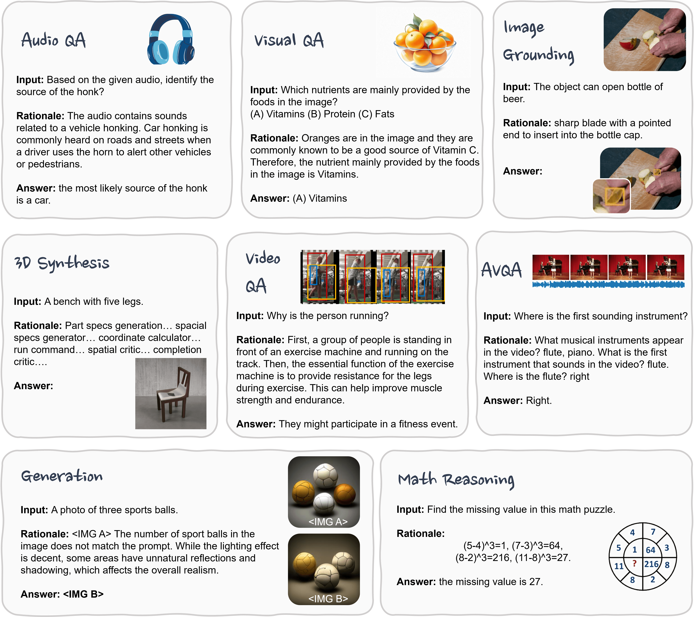

<h1 align="center">Awesome-MCoT</h1>
Multimodal Chain-of-Thought Reasoning: A Comprehensive Survey

# 🎨 Introduction

A scene graph is a topological structure representing a scene described in text, image, video, or etc.
In this graph, the nodes correspond to object bounding boxes with their category labels and attributes, while the edges represent the pair-wise relationships between objects.

  

# 📕 Table of Contents

- [🌷 MCoT Datasets and Benchmarks](#-datasets)
- [🍕 Scene Graph Generation](#-scene-graph-generation)
  - [2D (Image) Scene Graph Generation](#2d-image-scene-graph-generation)
  - [Panoptic Scene Graph Generation](#panoptic-scene-graph-generation)

---

# MCoT Datasets and Benchmarks {#datasets}

| **Datasets**   | **Year** | **Task**              | **Domain**            | **Modality** | **Format**    | **Samples** |
|:--------------:|:--------:|:---------------------:|:---------------------:|:------------:|:-------------:|:-----------:|
| ScienceQA      | 2022     | VQA                   | Science               | T, I         | MC            | 21K         |
| A-OKVQA        | 2022     | VQA                   | Common                | T, I         | MC            | 25K         |
| EgoCoT         | 2023     | VideoQA               | Common                | T, V         | Open          | 200M        |
| VideoCoT       | 2024     | VideoQA               | Human Action          | T, V         | Open          | 22K         |
| VideoEspresso  | 2024     | VideoQA               | Common                | T, V         | Open          | 202,164     |
| EMMA-X         | 2024     | Robot Manipulation    | Indoor                | T, V         | Robot Actions | 60K         |
| M3CoT          | 2024     | VQA                   | Science, Math, Common | T, I         | MC            | 11.4K       |
| MAVIS          | 2024     | ScienceQA             | Math                  | T, I         | MC and Open   | 834K        |
| MMMU           | 2023     | VQA                   | Arts, Science         | T, I         | MC and Open   | 11.5K       |
| SEED           | 2023     | VQA                   | Common                | T, I         | MC            | 19K         |
| MathVista      | 2023     | ScienceQA             | Math                  | T, I         | MC and Open   | 6,141       |
| MathVerse      | 2024     | ScienceQA             | Math                  | T, I         | MC and Open   | 15K         |
| Math-Vision    | 2024     | ScienceQA             | Math                  | T, I         | MC and Open   | 3040        |
| MeViS          | 2023     | Referring VOS         | Common                | T, V         | Dense Mask    | 2K          |
| VSIBench       | 2024     | VideoQA               | Indoor                | T, V         | MC and Open   | 5K          |
| HallusionBench | 2024     | VQA                   | Common                | T, I         | Yes-No        | 1,129       |
| AV-Odyssey     | 2024     | AVQA                  | Common                | T, V, A      | MC            | 4,555       |
| AVHBench       | 2024     | AVQA                  | Common                | T, V, A      | Open          | 5,816       |
| RefAVS-Bench   | 2024     | Referring AVS         | Common                | T, V, A      | Dense Mask    | 4,770       |
| MMAU           | 2024     | AQA                   | Common                | T, A         | MC            | 10K         |
| AVTrustBench   | 2025     | AVQA                  | Common                | T, V, A      | MC and Open   | 600K        |
| MIG-Bench      | 2025     | Multi-image Grounding | Common                | T, I         | BBox          | 5.89K       |
| CoMT           | 2024     | VQA                   | Common                | T, I         | MC            | 3,853       |
| OmniBench      | 2024     | VideoQA               | Common                | T, I, A      | MC            | 1,142       |
| WorldQA        | 2024     | VideoQA               | Common                | T, V, A      | Open          | 1,007       |
| MiCEval        | 2024     | VQA                   | Common                | T, I         | Open          | 643         |
| OlympiadBench  | 2024     | ScienceQA             | Maths, Physics        | T, I         | Open          | 8,476       |
| MME-CoT        | 2025     | VQA                   | Science, Math, Common | T, I         | MC and Open   | 1,130       |
| EMMA           | 2025     | VQA                   | Science               | T, I         | MC and Open   | 2,788       |

